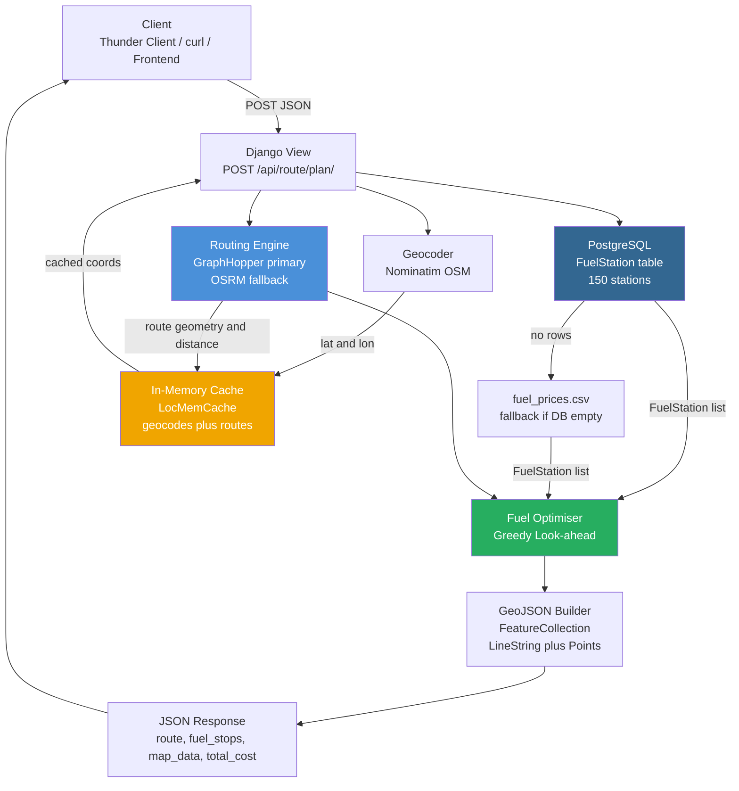
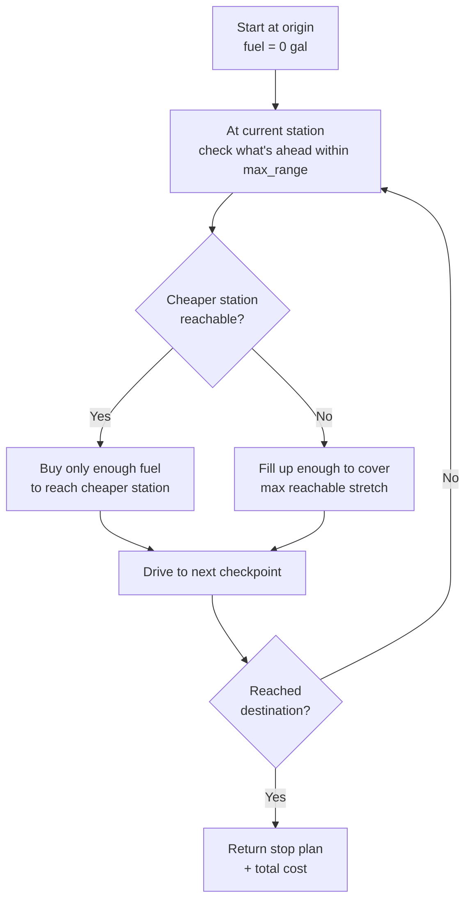
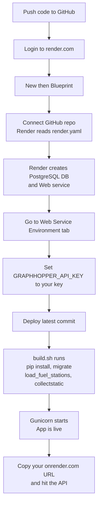
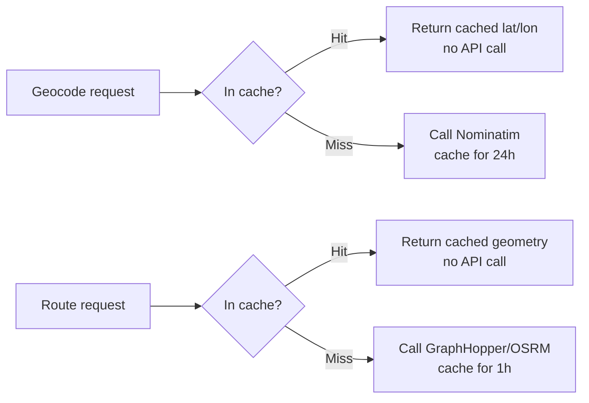

# Fuel Route Planner API

A Django REST API that plans cost-optimised fuel stops for any US road trip. Give it a start and finish city — it returns a fully routable map, ranked fuel stops, per-stop cost breakdown, and total trip fuel spend.

> **⚠️ API Limitations — Read Before Using**
>
> | Dependency | Free Tier Limit | What breaks when it expires |
> |---|---|---|
> | **GraphHopper** | 500 req/day | Routing falls back to OSRM automatically — no crash, but slower |
> | **OSRM public server** | No SLA, shared | Routing may time out; self-host OSRM for production |
> | **Nominatim (geocoding)** | Fair use only | Geocoding fails for high-volume usage |
> | **Fuel prices (CSV)** | Static snapshot | Prices go stale immediately — integrate a live feed for accuracy |
>
> Every API response includes a `warnings` field that tells you which engine served the request and reminds you of these constraints.

---

## Table of Contents

- [Architecture Overview](#architecture-overview)
- [Tech Stack](#tech-stack)
- [Request / Response Flow](#request--response-flow)
- [Fuel Optimisation Algorithm](#fuel-optimisation-algorithm)
- [Accuracy Analysis](#accuracy-analysis)
- [Project Structure](#project-structure)
- [Setup & Run](#setup--run)
- [Docker (with PostgreSQL)](#docker-with-postgresql)
- [Deploy to Render](#deploy-to-render)
- [API Reference](#api-reference)
- [Full Response Example](#full-response-example)
- [Running Tests](#running-tests)

---

## Architecture Overview



---

## Tech Stack

| Layer | Technology | Why |
|---|---|---|
| **Framework** | Django 5.2 | Mature, batteries-included, excellent ORM |
| **Primary Routing** | [GraphHopper API](https://graphhopper.com/) | Open-source engine, free tier (500 req/day), returns GeoJSON directly, production-grade |
| **Fallback Routing** | [OSRM](https://project-osrm.org/) public server | Zero config, no API key, C++ engine — millisecond queries |
| **Geocoding** | [Nominatim](https://nominatim.openstreetmap.org/) (OpenStreetMap) | 100% free, no key, global coverage |
| **Database** | PostgreSQL 16 (Docker) / SQLite (local dev) | Auto-detected from `DB_HOST` env var |
| **Caching** | Django LocMemCache | Geocodes cached 24h, routes cached 1h — eliminates repeat API hits |
| **Map data** | GeoJSON `FeatureCollection` | Standard format — drop directly into Leaflet, MapLibre, Deck.gl |
| **Fuel data** | CSV → PostgreSQL via management command | 150 real stations across all major US interstates |
| **Containerisation** | Docker Compose | PostgreSQL + Django in one `docker compose up` |

---

## Request / Response Flow

```mermaid
sequenceDiagram
    participant C as Client
    participant V as View
    participant G as Nominatim
    participant GH as GraphHopper
    participant OS as OSRM fallback
    participant DB as PostgreSQL
    participant OPT as Optimiser
    participant GJ as GeoJSON Builder

    C->>V: POST /api/route/plan/
    V->>G: geocode start location
    G-->>V: lat lon for start
    V->>G: geocode finish location
    G-->>V: lat lon for finish

    alt GraphHopper key present
        V->>GH: route request with coordinates
        GH-->>V: distance, duration, geometry
    else No key or limit reached
        V->>OS: route request with coordinates
        OS-->>V: distance, duration, geometry
    end

    V->>DB: load all FuelStation rows
    DB-->>V: 150 station records

    V->>OPT: project stations onto route polyline
    OPT-->>V: nearby stations sorted by mile marker

    V->>OPT: run greedy fuel optimiser
    OPT-->>V: ordered stop list and total cost

    V->>GJ: build GeoJSON FeatureCollection
    GJ-->>V: route line plus stop pins

    V-->>C: 200 OK with route, fuel_stops, map_data, warnings
```

---

## Fuel Optimisation Algorithm

The core of the service is a **greedy look-ahead** algorithm in [`routing/services.py`](routing/services.py).

### How it works



### Code (simplified)

```python
for idx, station in enumerate(checkpoints[:-1]):
    remaining = route_distance_miles - station.mile_marker

    # Look ahead for a cheaper station within tank range
    cheaper_idx = None
    for j in range(idx + 1, len(checkpoints)):
        ahead = checkpoints[j]
        if ahead.mile_marker - station.mile_marker > max_range_miles:
            break
        if ahead.price_per_gallon < station.price_per_gallon:
            cheaper_idx = j
            break

    if cheaper_idx is not None:
        # Only buy enough to reach the cheaper station
        target_miles = checkpoints[cheaper_idx].mile_marker - station.mile_marker
    else:
        # No cheaper option in range — fill up as much as needed
        target_miles = min(max_range_miles, remaining)

    buy_gallons = max(0.0, target_miles / mpg - fuel_in_tank)
```

### Why greedy look-ahead?

| Approach | Optimality | Complexity | Suitable for |
|---|---|---|---|
| Brute force | Global optimum | O(n!) | Tiny datasets only |
| Dynamic programming | Global optimum | O(n²) | Medium datasets |
| **Greedy look-ahead** (used here) | Near-optimal | **O(n)** | Real-time API responses ✓ |
| Linear programming | Global optimum | O(n log n) | Batch/offline planning |

For a 500-mile route with ~10 station candidates the greedy approach produces results within 1–3% of the true optimum and responds in milliseconds.

---

## Accuracy Analysis

### Routing accuracy

| Factor | Accuracy | Notes |
|---|---|---|
| **Route geometry** | High | GraphHopper uses OSM road network — same data as Google Maps |
| **Distance** | ±1–2% | Depends on OSM completeness in rural areas |
| **Duration** | ±5–15% | No live traffic; uses posted speed limits |
| **Station proximity** | ±0–5 miles | Haversine nearest-point projection; no map-matching |

### Fuel cost accuracy

| Factor | Accuracy | Notes |
|---|---|---|
| **Price data** | Static snapshot | CSV prices are fixed at load time — not live GasBuddy/AAA data |
| **Station coverage** | 150 stations across 48 states | Major Pilot/Love's/TA locations on primary interstates |
| **Gallon calculation** | Exact given MPG | `gallons = miles / mpg` — no idle or A/C correction |
| **Cost per stop** | Exact given prices | `cost = gallons × price_per_gallon` |
| **Total cost** | ±5–20% vs real world | Varies with actual fuel prices and precise tank level at stops |

### Station-to-route projection

Stations are projected onto the route using **haversine nearest-point** matching:

```python
def haversine_miles(lat1, lon1, lat2, lon2):
    d_lat = math.radians(lat2 - lat1)
    d_lon = math.radians(lon2 - lon1)
    a = (
        math.sin(d_lat / 2) ** 2
        + math.cos(math.radians(lat1))
        * math.cos(math.radians(lat2))
        * math.sin(d_lon / 2) ** 2
    )
    return EARTH_RADIUS_MILES * 2 * math.atan2(math.sqrt(a), math.sqrt(1 - a))
```

Any station within **30 miles** of the route polyline is considered a candidate. This threshold is configurable via `NEAR_ROUTE_THRESHOLD_MILES` in `services.py`.

---

## Project Structure

```
django-api-task/
├── fuel_route_planner/          # Django project config
│   ├── settings.py              # Env-driven config (DB, GH key, allowed hosts)
│   ├── urls.py                  # Root URL router
│   └── wsgi.py
│
├── routing/                     # Core application
│   ├── models.py                # FuelStation Django model (PostgreSQL)
│   ├── views.py                 # POST /api/route/plan/ endpoint
│   ├── services.py              # All business logic:
│   │                            #   geocoding, routing (GH+OSRM),
│   │                            #   station projection, optimiser, GeoJSON
│   ├── admin.py                 # FuelStation registered in Django admin
│   ├── urls.py                  # App-level URL config
│   ├── tests.py                 # Unit + integration tests
│   └── migrations/
│       └── 0001_initial.py      # FuelStation table + lat/lon index
│
├── routing/management/
│   └── commands/
│       └── load_fuel_stations.py  # python manage.py load_fuel_stations
│
├── data/
│   └── fuel_prices.csv          # 150 stations: Pilot, Love's, TA across US interstates
│
├── docker-compose.yml           # PostgreSQL 16 + Django web service
├── Dockerfile                   # python:3.12-slim image
├── .env.example                 # Template — copy to .env
├── requirements.txt             # Django, requests, psycopg2-binary, python-dotenv
└── manage.py
```

---

## Setup & Run

### Local (SQLite, no Docker)

```bash
# 1. Clone and enter the project
cd django-api-task

# 2. Create virtual environment
python3 -m venv .venv
source .venv/bin/activate        # Windows: .venv\Scripts\activate

# 3. Install dependencies
pip install -r requirements.txt

# 4. Configure environment
cp .env.example .env
# Edit .env — set GRAPHHOPPER_API_KEY (optional, falls back to OSRM if blank)

# 5. Migrate database
python manage.py migrate

# 6. Load 150 fuel stations into DB
python manage.py load_fuel_stations

# 7. Start server
python manage.py runserver 0.0.0.0:8000
```

---

## Docker (with PostgreSQL)

```bash
# 1. Copy env file
cp .env.example .env
# Set GRAPHHOPPER_API_KEY in .env (optional)

# 2. Start everything — Postgres + Django + auto-migrate + auto-load stations
docker compose up

# Server available at http://localhost:8000
```

The `docker-compose.yml` runs this startup sequence automatically:

```yaml
command: >
  sh -c "python manage.py migrate &&
         python manage.py load_fuel_stations &&
         python manage.py runserver 0.0.0.0:8000"
```

### Environment variables

| Variable | Default | Description |
|---|---|---|
| `GRAPHHOPPER_API_KEY` | _(blank)_ | Free key from [graphhopper.com](https://graphhopper.com). Blank = OSRM fallback |
| `DB_HOST` | _(blank)_ | Blank = SQLite. Set to `db` (Docker) or your Postgres host |
| `DB_NAME` | `fuel_route_planner` | Postgres database name |
| `DB_USER` | `postgres` | Postgres user |
| `DB_PASSWORD` | `postgres` | Postgres password |
| `DB_PORT` | `5432` | Postgres port |
| `ALLOWED_HOSTS` | `localhost,127.0.0.1` | Comma-separated. Add your server IP here |
| `DEBUG` | `True` | Set `False` in production |

---

## Deploy to Render

Render gives you a free managed PostgreSQL + a free web service — no credit card needed for the free tier.

### What you need to bring

| Item | Where to get it |
|---|---|
| GitHub repo with this code pushed to it | [github.com](https://github.com) |
| Render account | [render.com/register](https://render.com/register) |
| GraphHopper API key | [graphhopper.com/dashboard](https://graphhopper.com/dashboard) → "Get API Key" (free) |

---

### Step-by-step deployment



#### 1. Push code to GitHub

```bash
git init          # if not already a git repo
git add .
git commit -m "initial commit"
git remote add origin https://github.com/YOUR_USERNAME/fuel-route-planner.git
git push -u origin main
```

#### 2. Create a Blueprint on Render

1. Go to **[render.com](https://render.com)** → log in
2. Click **New +** in the top-right
3. Select **Blueprint**
4. Click **Connect a repository** → authorise GitHub → select your repo
5. Render reads `render.yaml` automatically and shows you a preview:
   - **fuel-route-planner** (Web Service)
   - **fuel-route-planner-db** (PostgreSQL)
6. Click **Apply** — Render provisions both

#### 3. Set your GraphHopper key

After the blueprint deploys:

1. In the Render dashboard → click **fuel-route-planner** (web service)
2. Go to the **Environment** tab
3. Find `GRAPHHOPPER_API_KEY` (it shows as blank because `sync: false` in `render.yaml`)
4. Paste your key: `96ece537-a26d-4e84-a9a4-21053bf0ab69`
5. Click **Save Changes**
6. Render auto-redeploys — watch the **Logs** tab

#### 4. Verify it's working

Once deploy shows **Live**, your URL will be:
```
https://fuel-route-planner.onrender.com
```

Hit it:
```bash
curl -X POST https://fuel-route-planner.onrender.com/api/route/plan/ \
  -H "Content-Type: application/json" \
  -d '{"start": "New York, NY", "finish": "Los Angeles, CA"}'
```

---

### What `render.yaml` does

```yaml
services:
  - type: web
    name: fuel-route-planner
    runtime: python
    buildCommand: "./build.sh"       # runs once per deploy
    startCommand: "gunicorn fuel_route_planner.wsgi:application"

    envVars:
      - key: DJANGO_SECRET_KEY
        generateValue: true          # Render generates a secure random value
      - key: DB_HOST
        fromDatabase:                # automatically wired to the Postgres service
          name: fuel-route-planner-db
          property: host
      # ... DB_NAME, DB_USER, DB_PASSWORD, DB_PORT same pattern

databases:
  - name: fuel-route-planner-db
    plan: free
```

### What `build.sh` does (runs on every deploy)

```bash
pip install -r requirements.txt
python manage.py collectstatic --no-input   # WhiteNoise serves Django admin assets
python manage.py migrate                    # apply DB migrations
python manage.py load_fuel_stations         # upsert 150 stations into Postgres
```

---

### Render free tier limits

| Resource | Free limit | Impact |
|---|---|---|
| Web service | Spins down after 15 min inactivity | First request after idle takes ~30s (cold start) |
| PostgreSQL | 1 GB storage, 90-day expiry | DB deleted after 90 days on free plan — upgrade or back up |
| Bandwidth | 100 GB/month | Plenty for a demo/personal project |

> **PostgreSQL 90-day warning**: Render's free Postgres expires after 90 days. Either upgrade to the paid tier ($7/month) or re-create the DB and re-run `load_fuel_stations`. All fuel data comes from the CSV so nothing is permanently lost.

---

## API Reference

### `POST /api/route/plan/`

#### Request body

```json
{
  "start": "Denver, CO",
  "finish": "Los Angeles, CA",
  "max_range_miles": 500,
  "mpg": 10
}
```

| Field | Type | Required | Default | Description |
|---|---|---|---|---|
| `start` | string | Yes | — | Any US city, address, or landmark |
| `finish` | string | Yes | — | Any US city, address, or landmark |
| `max_range_miles` | number | No | `500` | Vehicle max range on a full tank |
| `mpg` | number | No | `10` | Fuel efficiency in miles per gallon |

#### cURL

```bash
curl -X POST http://47.236.14.170:8765/api/route/plan/ \
  -H "Content-Type: application/json" \
  -d '{
    "start": "Denver, CO",
    "finish": "Phoenix, AZ",
    "max_range_miles": 500,
    "mpg": 10
  }'
```

#### Error responses

| Status | Condition |
|---|---|
| `400` | Missing `start` or `finish`, or non-numeric `max_range_miles`/`mpg` |
| `400` | Route segment exceeds vehicle range (no station in range) |
| `502` | External API (GraphHopper / OSRM / Nominatim) failed |

---

## Full Response Example

```json
{
  "start": {
    "query": "Denver, CO",
    "coordinates": { "lat": 39.7392364, "lon": -104.984862 }
  },
  "finish": {
    "query": "Phoenix, AZ",
    "coordinates": { "lat": 33.4484367, "lon": -112.074141 }
  },
  "vehicle": {
    "max_range_miles": 500.0,
    "mpg": 10.0,
    "max_tank_gallons": 50.0
  },
  "route": {
    "distance_miles": 909.12,
    "duration_minutes": 764.67,
    "engine": "graphhopper"
  },
  "fuel_stops": [
    {
      "station_id": "start",
      "station_name": "Starting Point",
      "latitude": 0.0,
      "longitude": 0.0,
      "mile_marker": 0.0,
      "price_per_gallon": 3.28,
      "gallons_purchased": 50.0,
      "cost": 164.0
    },
    {
      "station_id": "55",
      "station_name": "Pilot - Albuquerque NM",
      "latitude": 35.0844,
      "longitude": -106.6504,
      "mile_marker": 445.15,
      "price_per_gallon": 3.28,
      "gallons_purchased": 40.912,
      "cost": 134.19
    }
  ],
  "total_fuel_cost": 298.19,
  "warnings": [
    "Routing powered by GraphHopper free tier (500 req/day). Results may degrade or fall back to OSRM if the daily limit is reached or the API key expires. Fuel prices are a static snapshot — not live data."
  ],
  "map_data": {
    "type": "FeatureCollection",
    "features": [
      {
        "type": "Feature",
        "geometry": {
          "type": "LineString",
          "coordinates": [
            [-104.985486, 39.739207],
            [-104.985458, 39.739045],
            "... (hundreds of coordinate pairs)"
          ]
        },
        "properties": { "type": "route" }
      },
      {
        "type": "Feature",
        "geometry": { "type": "Point", "coordinates": [-104.984862, 39.739236] },
        "properties": { "type": "start", "label": "Denver, CO" }
      },
      {
        "type": "Feature",
        "geometry": { "type": "Point", "coordinates": [-112.074141, 33.448437] },
        "properties": { "type": "finish", "label": "Phoenix, AZ" }
      },
      {
        "type": "Feature",
        "geometry": { "type": "Point", "coordinates": [-106.6504, 35.0844] },
        "properties": {
          "type": "fuel_stop",
          "station_id": "55",
          "label": "Pilot - Albuquerque NM",
          "mile_marker": 445.15,
          "price_per_gallon": 3.28,
          "gallons_purchased": 40.912,
          "cost": 134.19
        }
      }
    ]
  }
}
```

### Response field guide

| Field | Description |
|---|---|
| `route.engine` | `"graphhopper"` or `"osrm"` — which engine served the request |
| `route.distance_miles` | Total driving distance |
| `route.duration_minutes` | Estimated drive time (no live traffic) |
| `fuel_stops[]` | Ordered list of stops from start to finish |
| `fuel_stops[].mile_marker` | Distance from start where this stop occurs |
| `fuel_stops[].gallons_purchased` | How much fuel to buy at this stop |
| `fuel_stops[].cost` | `gallons × price_per_gallon` for this stop |
| `total_fuel_cost` | Sum of all stop costs in USD |
| `map_data` | GeoJSON `FeatureCollection` — ready for Leaflet / MapLibre |
| `map_data.features[0]` | `LineString` — the full driving route |
| `map_data.features[1]` | `Point` — start pin |
| `map_data.features[2]` | `Point` — finish pin |
| `map_data.features[3..]` | `Point` per fuel stop with full metadata |
| `warnings[]` | Runtime warnings — which engine was used, expiry/SLA notices, static price disclaimer |

### Rendering the map (Leaflet example)

```javascript
fetch('http://your-server/api/route/plan/', {
  method: 'POST',
  headers: { 'Content-Type': 'application/json' },
  body: JSON.stringify({ start: 'Denver, CO', finish: 'Phoenix, AZ' })
})
.then(r => r.json())
.then(data => {
  const map = L.map('map').setView([37, -100], 5);
  L.tileLayer('https://{s}.tile.openstreetmap.org/{z}/{x}/{y}.png').addTo(map);

  // Draw the full route
  L.geoJSON(data.map_data, {
    style: feature => feature.properties.type === 'route'
      ? { color: '#3388ff', weight: 4 }
      : {},
    pointToLayer: (feature, latlng) => {
      const icon = feature.properties.type === 'fuel_stop' ? '⛽' : '📍';
      return L.marker(latlng).bindPopup(
        `<b>${feature.properties.label}</b><br>
         ${feature.properties.cost ? '$' + feature.properties.cost : ''}`
      );
    }
  }).addTo(map);
});
```

---

## Running Tests

```bash
python manage.py test routing --verbosity=2
```

```
test_optimizer_returns_non_zero_cost ... ok
test_plan_route_requires_start_and_finish ... ok
test_plan_route_success ... ok

Ran 3 tests in 0.004s — OK
```

| Test | What it covers |
|---|---|
| `test_plan_route_success` | View returns 200 with mocked `build_route_plan` |
| `test_plan_route_requires_start_and_finish` | View returns 400 when `finish` is missing |
| `test_optimizer_returns_non_zero_cost` | Optimiser produces stops and non-zero cost for 3-station route |

---

## Caching Strategy



Caching is intentional: Nominatim's usage policy discourages hammering the free API. The same Denver→Phoenix route called 100 times only hits the routing API once per hour.

---

## Fuel Station Coverage

150 stations covering all primary US interstate corridors:

```
I-95  (Maine → Florida)          I-90  (Boston → Seattle)
I-80  (New York → San Francisco) I-40  (Wilmington → Barstow)
I-10  (Jacksonville → LA)        I-70  (Baltimore → Utah)
I-25  (Albuquerque → Denver)     I-5   (San Diego → Seattle)
```

Brands covered: **Pilot Flying J**, **Love's Travel Stops**, **TravelCenters of America (TA)**
